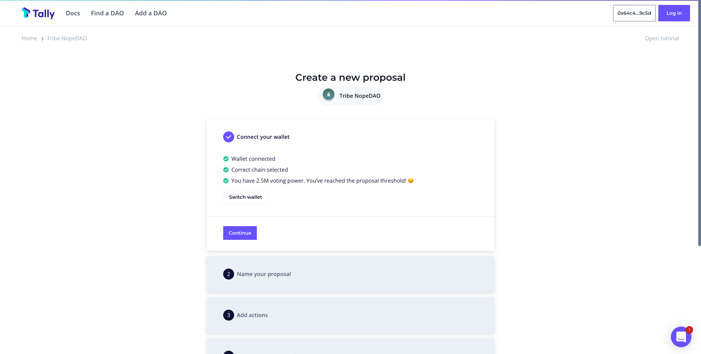
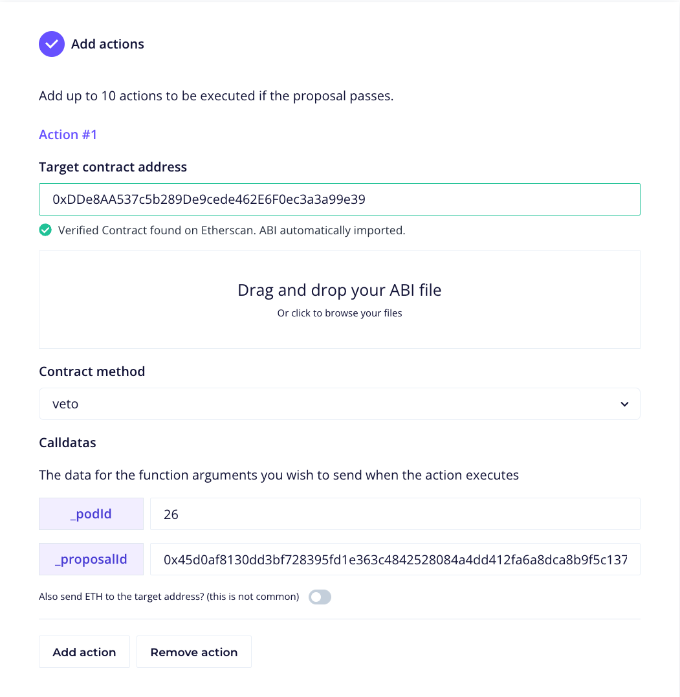

To directly create a Nope DAO veto on-chain follow these 3 steps:

**1. Fetch the timelock ID of the pod proposal that should be vetoed**
- This can be found on:
    - The https://tribe.fei.money governance post where the proposal was initiated
    - The open source timelock proposal viewing tool, [Fei-Tools](https://fei-tools.com/#/TimelockTransactions)
- In the near future, the timelockID will also be available on the [Governance Dashboard](https://tribedao.xyz/governance)

**2. Go to the Tally Nope DAO proposal creator and create a veto proposal: https://www.tally.xyz/governance/eip155:1:0x6C7aF43Ce97686e0C8AcbBc03b2E4f313c0394C7/proposal/create**

- Create a proposal to call the `veto()` method of the `podAdminGateway` contract. This contract allows the Nope DAO, Tribal Council and Security Guardian to veto a pod proposal, given the pod's ID and the proposal timelock ID

- There is currently one live pod, the Tribal Council. It has a pod ID of `25`. The timelock proposal ID that is being vetoed can be sourced from one of the destinations outlined in step 1.

**3. If 10M TRIBE votes in favour, the `Execute` button on Tally will become available. Click to veto the pod proposal**
