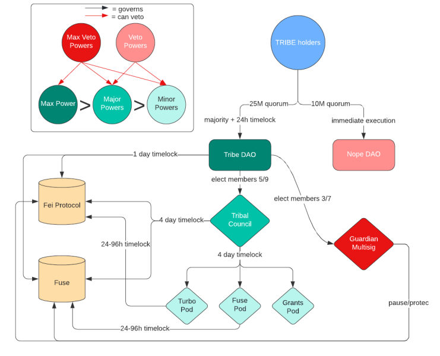

# Overview

The Tribe ecosystem makes use of an optimistic governance model which has four layers:

**1. Tribe DAO**
- The highest level entity and has ultimate control over managing the protocol.

**2. Optimistic governance pods**
- These are working groups of community members and protocol experts sitting on a Gnosis safe connected to a timelock. They are able to optimistically govern specific parts of the protocol. 
- Specifically, there is a top level Tribal Council pod that oversees other pods and is able to run the protocol on an operational day to day basis. Other pods will be created in the future to manage different aspects of the protocol

**3. Nope DAO** 
- A sub-DAO with a low quorum that is specifically able to veto governance pod proposals.

**4. Guardian**
- An emergency multisig operated by the Core teams which can take limited safety and security actions in the event of a protocol emergency.

The following pages contain detailed information on these different components of the governance system and how they work together.

## Role of the Tribal Council and NopeDAO
The Tribal Council can be thought of as an "express lane" for non-controversial proposals to pass on-chain in a low friction manner. There are checks and balances to this, in that there is a Nope DAO which is able to veto any proposal the community finds controversial. 

When a Tribal Council proposal is veto'd, the proposal must instead pass through the standard governance channels of a full DAO vote in order to enacted on-chain. 

It is important to note that a Nope DAO veto does not act as a terminal end to a proposal. It just means that the proposal is controversial and should not go through the "express lane". Instead, it has to go through a full DAO vote.

# Architecture
The interactions between the governance system are summarised below:

## Get involved
1. View Tribe DAO governance proposals: https://tribedao.xyz/governance
2. Propose and vote on Tribe DAO proposals: https://www.tally.xyz/governance/eip155:1:0x0BEF27FEB58e857046d630B2c03dFb7bae567494 
3. Propose a veto for a governance pod proposal: https://www.tally.xyz/governance/eip155:1:0x6C7aF43Ce97686e0C8AcbBc03b2E4f313c0394C7 

